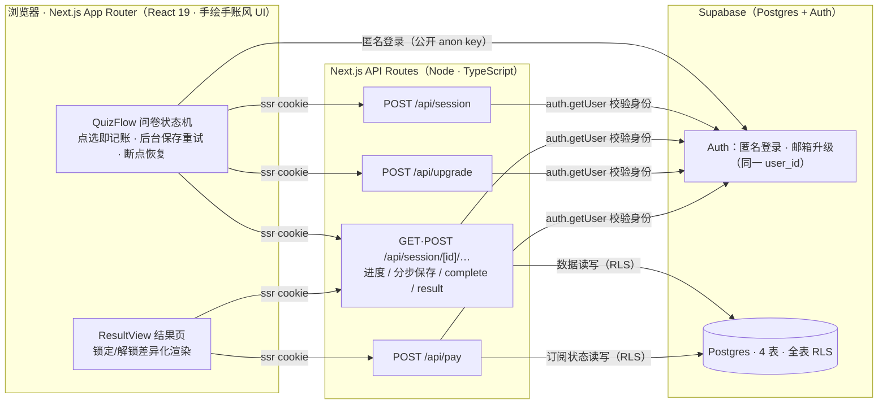
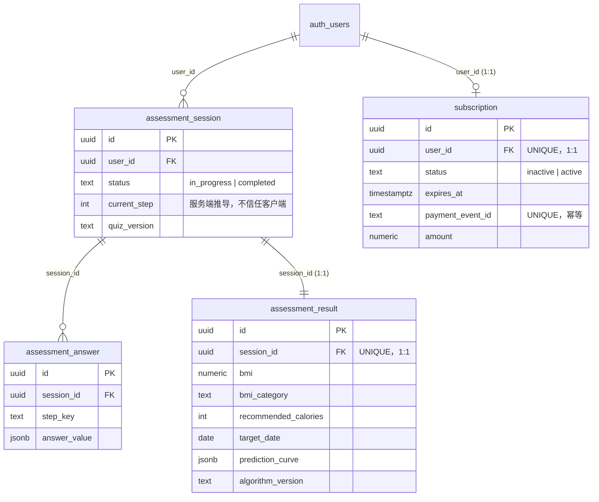

# BetterMe

健身/健康测评 funnel：33 题问卷 → 服务端健康评估（BMI/BMR/摄入/预测曲线）→ 结果页（锁定/解锁差异化）→ 模拟订阅解锁 30 天每日计划。

**技术栈**：Next.js 16 (App Router) · TypeScript · Tailwind 4 · Supabase（Postgres + Auth 匿名登录）

[](https://github.com/LosLiSang/better-me/actions/workflows/ci-cd.yml)

**线上地址**：https://better-me-jet-omega.vercel.app

## 整体架构



分层原则：**浏览器只负责采集与呈现**——数据读写全部经 API Routes（服务端校验 + RLS 双道闸），客户端仅直连 Supabase Auth 做身份；**计算、鉴权、脱敏都在服务端**；进度与状态一致性不依赖前端行为。

## 关键逻辑

**① 身份模型：无感开户 + 无缝升级**
首访 `signInAnonymously()` 静默创建匿名用户，业务表 `user_id` 直接外键引用 `auth.users`（不建业务用户表）；付费前要求升级正式账号 = `auth.updateUser` 补邮箱密码，**同一 user_id 无缝保留全部测评数据**。

**② 进度推导在服务端，不信任客户端**
`current_step` = 题库顺序中第一个未作答题（`deriveCurrentStep`）。分步保存经 `UNIQUE(session_id, step_key)` upsert 幂等收敛：乱序、重复、回退提交都不会破坏状态；二次 `complete` 返回 409。

**③ 服务端计算 + 版本化**
`complete` 先校验 7 个必答题齐全（缺 → 409 + missing 列表），再执行健康评估（BMI 分类 / Mifflin-St Jeor BMR / 建议摄入带下限兑底 / 目标日期 / 预测曲线）与确定性 30 天计划生成器，结果带 `algorithm_version` 落库。

**④ 订阅差异化 = 查询层物理脱敏**
非会员的 result 查询 select 列表中**根本不含** `prediction_curve` / `plan_30d` 完整值（查不到，而非查出再藏），仅返回 Day1 预览 + 提示；会员窗口 `[starts_at, expires_at)` 内返回完整数据。`weeklyRateKg` 从曲线首末差推回，不重复存列。

**⑤ 支付幂等 + 暴露面治理**
`/api/pay` 以 `payment_event_id` 唯一约束保幂等，续期从 `max(now, expires_at)` 顺延不缩短；匿名用户拒绝（403）；模拟支付由服务端开关 `DEMO_PAYMENT_ENABLED` 治理（默认关闭返回 501，公开演示环境显式开启）。

**⑥ 前端提交时机：非阻塞 + 后台重试**
点选立即本地记账并前进（不等网络）；保存后台带退避重试，彻底失败才提示可手动重试；`complete` 前统一 flush 在途保存。恢复时先验证登录态、再校验旧 sessionId 归属，stale 会话自动重建（修「中断后回跳」）。

## API 一览

所有业务接口需 `Cookie`（@supabase/ssr 会话）；跨用户访问一律 404（不泄露存在性）。

| 方法 | 路径 | 鉴权 | 说明 | 成功响应 | 关键错误 |
|---|---|---|---|---|---|
| POST | /api/session | 匿名+ | 开会话 | `{sessionId, currentStep}` | 500 |
| GET | /api/session/[id] | 属主 | 进度 + 已答内容 | `{sessionId, status, quizVersion, currentStep, answers}` | 404 session_not_found |
| POST | /api/session/[id]/step | 属主 | 分步保存（幂等 upsert）| `{currentStep}` | 400 invalid_answer / cross_validation_failed；409 session_completed |
| POST | /api/session/[id]/complete | 属主 | 服务端计算 + 落库 | `{resultId}` | 409 already_completed / required_steps_missing |
| GET | /api/session/[id]/result | 属主 | 差异化返回（locked + data + subscription）| `{locked, data, subscription}` | 404 result_not_ready |
| POST | /api/upgrade | 匿名 | 匿名升级正式账号 `{email, password}` | `{ok: true}` | 400 invalid_email / password_too_short / upgrade_failed |
| POST | /api/pay | 正式 | 模拟支付回调（幂等）| `{ok, expiresAt}` | 403 anonymous_forbidden；501 payment_disabled |
| GET | /api/ping | 公开 | 探活 | `{ok, t}` | — |

非法数值 / 越界输入在 step 层被拒（400 + `detail` 错误列表），并有单测与 E2E 覆盖（见「验证」一节）。

## 数据库 Schema



要点：用户身份直接复用 `auth.users`（含匿名用户），不建业务用户表；`assessment_answer` 以 `UNIQUE(session_id, step_key)` 实现分步保存幂等；`subscription` 用户级 1:1、`payment_event_id` 唯一保支付幂等；全表启用 RLS 按 `auth.uid()` 隔离。

## 模拟支付重放（cURL）

```bash
SB=https://hvbudfagfzikefytjyqs.supabase.co
SITE=https://better-me-jet-omega.vercel.app
ANON=<云项目 anon key，见下方测试账号说明>

# 1. 密码登录拿 token（测试账号，见下）
RES=$(curl -s -X POST "$SB/auth/v1/token?grant_type=password" \
  -H "apikey: $ANON" -H "Content-Type: application/json" \
  -d '{"email":"<测试账号>","password":"<密码>"}')
AT=$(echo "$RES" | jq -r .access_token); RT=$(echo "$RES" | jq -r .refresh_token)

# 2. 拼 @supabase/ssr cookie（服务端由此识别用户）
COOKIE="sb-hvbudfagfzikefytjyqs-auth-token=base64-$(printf '{\"access_token\":\"%s\",\"refresh_token\":\"%s\",\"token_type\":\"bearer\"}' "$AT" "$RT" | base64 -w0)"

# 3. 已支付会话的会员完整结果
curl -s "$SITE/api/session/<已支付sessionId>/result" -H "Cookie: $COOKIE"

# 4. 重放支付回调（续期顺延，幂等）
curl -s -X POST "$SITE/api/pay" -H "Cookie: $COOKIE"
```

**内置测试账号（已支付）**：见提交材料；也可自行走一遍 funnel 后注册升级，效果等同。

## 本地开发

```bash
# 1. 启动本地 Supabase 栈（需要 Docker Desktop）
npx supabase start

# 2. 配置环境变量
cp .env.example .env.local   # 本地栈默认值已内置（anon key 是标准本地演示密钥）

# 3. 安装依赖并启动
npm install
npm run dev                  # http://localhost:3000
```

## 数据库迁移

```bash
npx supabase db reset        # 本地：从零重放全部迁移（含 plan_30d）
npx supabase db push         # 云端：推送未应用的迁移（需先 login + link）
```

## 验证

```bash
npm test                     # 74 单测（vitest）
npm run lint
npm run build
# 端到端（需 dev server + 本地栈）：
set -a && . ./.env.local && set +a && node scripts/e2e-flow.mjs   # 25 项全流程
```

## Supabase Auth 设置

架构按「演示简化」设计，云端项目需手动确认两处（Dashboard → Authentication）：

- **匿名登录**：开启（`ensureSession` 依赖 `signInAnonymously`）
- **邮箱确认**：关闭（输入邮箱即生效；生产版应开启并走邮件验证）

## 部署（Vercel + Supabase 云）

1. Supabase 云项目 → `npx supabase login` → `npx supabase link --project-ref <ref>` → `npx supabase db push`
2. Vercel 导入 GitHub 仓库，配置环境变量（Production）：
   - `NEXT_PUBLIC_SUPABASE_URL` / `NEXT_PUBLIC_SUPABASE_ANON_KEY`：云项目 Settings → API
   - `DEMO_PAYMENT_ENABLED=true`：开放模拟支付（**默认关闭**，关闭时 `/api/pay` 返回 501「支付渠道暂未开通」）
3. Supabase Auth → Site URL 填 Vercel 生产域名

> ⚠️ `/api/pay` 是**模拟支付**：任何正式账号调用即解锁 30 天会员。UI 已明确标注，仅适用于演示定位；接真实支付前保持开关关闭。

## CI/CD（GitHub Actions）

`.github/workflows/ci-cd.yml` 五段流水线：

| Job | 内容 | 触发 |
|---|---|---|
| `quality` | tsc / lint / 74 单测 / build | push + PR |
| `integration` | CI 内起本地 Supabase 栈 → 25 项 E2E（仅本地栈） | push + PR |
| `migrate` | 生产迁移：`db push --dry-run` → `db push`（先迁移后部署） | master push，`ENABLE_CD=true` |
| `deploy` | Vercel prebuilt 部署（无 .git 临时目录执行） | master push，`ENABLE_CD=true` |
| `smoke` | 生产非破坏性冒烟：/api/ping、/ 200、未凭据 401 | deploy 成功后 |

**启用 CD（密钥只进 GitHub Secrets，不过手任何人/对话）：**

```bash
# ① 在 https://vercel.com/account/tokens 创建专用 CI token（选项目所在 team，设短有效期），然后：
gh secret set VERCEL_TOKEN
# ② Supabase Dashboard → Connect → Session pooler 连接串（含密码），然后：
gh secret set SUPABASE_DB_URL
# ③ 打开 CD 开关：
gh variable set ENABLE_CD --body true
```

安全设计：workflow 内零明文密钥（全部走 Secrets，日志自动掩码）；迁移用完整连接串 Secret（避免密码特殊字符拼 URI）；本地栈 anon key 运行时从 `supabase status` 提取而非硬编码；E2E 只打本地栈、生产只做非破坏性冒烟；deploy 在不含 `.git` 的临时目录执行。

## 架构与设计文档

见 `doc/架构设计.md`（路由闭环 / 脱敏策略 / 订阅模型）、`doc/问卷设计-v1.md`（33 题结构）。
